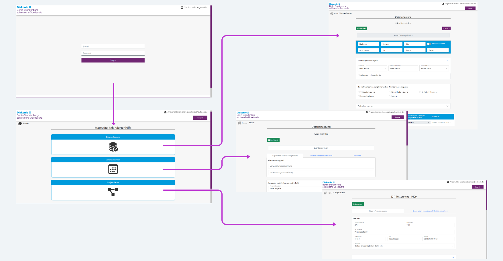

## Overview

This is a web application designed to help project teams efficiently save and manage client, project, and service data. With an intuitive interface and robust features, this application simplifies project management and allows statistical assessments about the progress of participating projects. At it's core is a form generating mechanism with which all of the forms in use are generated.

## Features

- **Client, Project, Service Management:** Easily store and manage data.
- **Form Generator:** Every form in this application is generated out of a json object.
- **Multiple Views:** Every Projecttype has it's own view on the website with individualised forms.

## Screenshots

